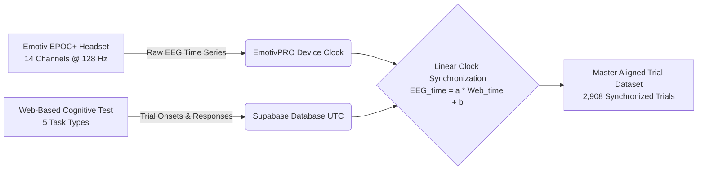

# Cognitive State Decoding from Electroencephalography (EEG): Complete Project Master Overview & Technical Specification

> **Document Purpose:** This document provides a comprehensive, exhaustive technical and theoretical overview of the entire EEG Cognitive State Decoding project. It details the experimental paradigms, data acquisition hardware, synchronization mechanisms, signal preprocessing, feature engineering, data augmentation, machine learning benchmarks, Explainable AI (XAI) validation, statistical significance testing, and the upcoming Deep Learning roadmap. It is designed to serve as the definitive blueprint for academic paper writing, team alignment, and mentor review.

---

## 1. Executive Summary & Project Objectives

### 1.1 Problem Statement & Background
Electroencephalography (EEG) provides a non-invasive, high-temporal-resolution window into human cerebral electrodynamics. Decoding mental states from multi-channel EEG has profound implications for Brain-Computer Interfaces (BCIs), adaptive learning environments, cognitive workload monitoring, neuroergonomics, and neurological diagnostics. 

However, multi-class cognitive state classification from consumer-grade EEG presents substantial challenges:
1. **Low Signal-to-Noise Ratio (SNR):** Non-invasive scalp potentials are in the microvolt ($\mu\text{V}$) range, vulnerable to ocular, myogenic, and environmental interference.
2. **Inter-Subject Neural Heterogeneity:** Baseline EEG power, skull impedance, and cortical geometry differ dramatically between individuals—a phenomenon known as the **"neural fingerprint"**.
3. **High Dimensionality & Non-Stationarity:** Raw continuous voltage time series require specialized feature representations that isolate task-relevant frequency dynamics from transient noise.

### 1.2 Core Project Goals
1. **Establish a Robust Classical Machine Learning Baseline:** Benchmark over 40 diverse model architectures (linear, kernel, ensemble, boosting, neural) to establish a rigorous, publishable performance ceiling using handcrafted neuro-engineering features.
2. **Overcome the Coarse-Window Accuracy Bottleneck:** Transform coarse 4-second trials into dense 1-second sliding sub-windows with 75% overlap, combined with Differential Entropy (DE) and per-subject normalization to drive classification accuracy from ~28% (near chance) to **73.34%**.
3. **Ensure Neurobiological Explainability (XAI):** Utilize Game-Theoretic TreeSHAP and Topographic Scalp Mapping to prove that model decisions align with established functional neuroanatomy (e.g., frontal beta/theta dynamics during arithmetic; occipital/parietal alpha modulation during pattern recognition).
4. **Conduct Rigorous Statistical Validation:** Apply McNemar’s tests, non-parametric permutation testing against chance level ($p < 0.001$), 95% bootstrap confidence intervals, and Cohen’s Kappa coefficient to ensure statistical validity.
5. **Bridge into Deep Learning:** Establish the foundation for the next phase: end-to-end spatial-temporal deep learning architectures (EEGNet, ShallowFBCSPNet, Bi-LSTM, Conformer/Transformers).

---

## 2. Experimental Paradigms: The 5 Cognitive Activities

Participants performed 5 standardized cognitive tasks designed to activate distinct neural circuits and cortical lobes.

```
+-----------------------------------------------------------------------------------+
|                           5 COGNITIVE EXPERIMENTAL TASKS                          |
+-----------------------------------------------------------------------------------+
|  1. Mental Arithmetic      --> Working memory & calculation (DLPFC, Parietal)     |
|  2. Pattern Recognition    --> Visual-spatial reasoning (Occipital, Parietal)     |
|  3. Working Memory         --> N-back / spatial span recall (Frontal Midline)     |
|  4. Reading Comprehension  --> Semantic & language processing (Temporal, Frontal) |
|  5. Sustained Attention    --> Vigilance & focus monitoring (Frontal, Central)    |
+-----------------------------------------------------------------------------------+
```

### Detailed Breakdown of Cognitive Tasks:

| Class Index | Cognitive Activity | Mental Operation & Stimulus | Primary Cortical Activation | Key Frequency Signatures |
|:---:|:---|:---|:---|:---|
| **Class 0** | **Mental Arithmetic** | Multi-step mathematical calculations without paper/pencil (e.g., sequential subtraction). | Dorsolateral Prefrontal Cortex (DLPFC), Left Angular Gyrus, Parietal Lobe. | **Frontal Theta ($\theta$) synchronization**, **Beta ($\beta$) power elevation**, decrease in central Alpha ($\alpha$). |
| **Class 1** | **Pattern Recognition** | Identifying logical sequences, geometric matrix transformations, and visual pattern matching. | Visual Cortex (Occipital O1, O2), Superior Parietal Cortex (P7, P8). | **Occipital/Parietal Alpha ($\alpha$) desynchronization** (visual engagement), **Gamma ($\gamma$) burst activity**. |
| **Class 2** | **Working Memory** | Short-term spatial and verbal memory retention and active retrieval (n-back / digit span). | Frontal Midline (AF3, AF4, F3, F4), Hippocampal-Cortical networks. | **Frontal Midline Theta (FMT)** elevation, **Theta-Gamma Phase-Amplitude Coupling**. |
| **Class 3** | **Reading Comprehension** | Syntactic parsing, deductive reasoning, and evaluating semantic truth values between statements. | Left Temporal Lobe (T7), Left Inferior Frontal Gyrus (Broca's area, F7/F3), Wernicke's area. | **Left-hemispheric Theta/Beta modulation**, **Inter-hemispheric Coherence alterations**. |
| **Class 4** | **Sustained Attention** | Vigilance, continuous stimulus tracking, and target discrimination under monotony. | Anterior Cingulate Cortex, Frontal Eye Fields (AF3, AF4, F4), Parietal Attention Network. | **Alpha ($\alpha$) suppression**, elevated **Beta/Theta ratio**, consistent P300-evoked dynamics. |

---

## 3. Data Acquisition & System Architecture

### 3.1 Hardware Specifications: Emotiv EPOC+
- **Channel Count:** 14 scalp electrodes + 2 reference sensors (CMS/DRL at P3/P4).
- **Electrode Montages (10-20 International System):** 
  - Frontal / Prefrontal: `AF3`, `F7`, `F3`, `FC5`, `FC6`, `F4`, `F8`, `AF4`
  - Temporal: `T7`, `T8`
  - Parietal: `P7`, `P8`
  - Occipital: `O1`, `O2`
- **Sampling Rate:** 128 Hz (128 voltage readings per channel per second; temporal resolution = 7.8125 ms).
- **Resolution:** 14-bit (0.51 $\mu\text{V}$ LSB) with hardware bandpass filtering (0.16–43 Hz) and notch filters at 50/60 Hz.
- **Contact Quality (CQ):** Continuous impedance monitoring (0–4 scale per electrode; overall 0–100 score).

### 3.2 Dual-Stream Data Architecture & Synchronization
The experimental system captures two asynchronous data streams that must be linked deterministically:
1. **EEG Continuous Voltage Stream (EmotivPRO):** High-frequency time series with monotonic device clock timestamps.
2. **Behavioral Cognitive Task Stream (Supabase / Web Platform):** Event logs containing trial onsets, reaction times, question difficulty, and participant responses with UTC server timestamps.



---

## 4. Signal Preprocessing & Feature Engineering Pipeline

### 4.1 Signal Preprocessing & Artifact Mitigation
1. **Common Average Referencing (CAR):** Re-references each channel against the instantaneous global scalp mean ($V_{\text{CAR}, i}(t) = V_i(t) - \frac{1}{14}\sum_{j=1}^{14} V_j(t)$), eliminating common-mode ambient electrical noise.
2. **Bandpass Filtering:** Zero-phase 4th-order Butterworth filter (0.5 Hz – 45.0 Hz) removing DC baseline drift and high-frequency muscular (EMG) artifacts.
3. **Contact Quality Gate:** Flagging and excluding segments with contact quality $CQ < 2$ or firmware interpolation $> 20\%$.

### 4.2 The Sub-Windowing Data Augmentation Strategy
- **Coarse Window Limitation:** Original 4-second trials ($N = 2,908$) were too coarse, averaging out fleeting sub-second cognitive shifts and providing insufficient samples for complex models.
- **Dense Sliding Sub-Windows:** Sliced each 4-second trial (512 samples) into **1-second sub-windows** (128 samples) with a **75% overlap** (step size = 32 samples = 250 ms).
- **Result:** Expanded dataset from 2,908 coarse trials to **37,804 dense sub-windows**, multiplying statistical power by $13\times$.

```
4-Second Trial (512 samples):
[================================================================]
[ Window 1: 0-128 ]
      [ Window 2: 32-160 ] (75% overlap)
            [ Window 3: 64-192 ]
                  ... -> 13 Sub-windows per trial -> 37,804 Total Samples
```

### 4.3 Feature Engineering: 252 Multi-Domain Neuro-Markers

For every 1-second sub-window across all 14 channels, we extract 252 features:

$$\text{Total Features} = 14 \text{ channels} \times 18 \text{ feature types} = 252 \text{ features}$$

```
+-----------------------------------------------------------------------------------------+
|                                252 EXTRACTED EEG FEATURES                               |
+-----------------------------------------------------------------------------------------+
| 1. Band Powers (PSD)   : Welch's PSD for Delta, Theta, Alpha, Beta, Gamma (5 x 14 = 70) |
| 2. Differential Entropy: DE = 0.5 * ln(2 * pi * e * BandPower)            (5 x 14 = 70) |
| 3. Band Power Ratios   : Theta/Alpha, Alpha/Beta, (Theta+Alpha)/Beta,     (4 x 14 = 56) |
|                          Beta/Gamma                                                     |
| 4. Statistical Moments : Mean, Variance, Skewness, Kurtosis               (4 x 14 = 56) |
+-----------------------------------------------------------------------------------------+
```

#### Feature Formulations:
1. **Welch's Power Spectral Density (PSD):**
   $$P_{xx}(f) = \frac{1}{K L U} \sum_{k=1}^K \left| \sum_{n=0}^{L-1} x_k[n] w[n] e^{-j 2\pi f n / f_s} \right|^2$$
   Extracted across canonical bands: $\delta$ (1–4 Hz), $\theta$ (4–8 Hz), $\alpha$ (8–13 Hz), $\beta$ (13–30 Hz), $\gamma$ (30–40 Hz).

2. **Differential Entropy (DE):**
   For a Gaussian-distributed frequency sub-band with variance $\sigma^2$:
   $$DE = \frac{1}{2} \ln(2 \pi e \sigma^2)$$
   Differential entropy captures non-linear complexity and has proven superior to raw band power in recent EEG cognitive and affective decoding literature.

3. **Cognitive Workload & Fatigue Ratios:**
   $$R_{\theta/\alpha} = \frac{P_\theta}{P_\alpha}, \quad R_{\alpha/\beta} = \frac{P_\alpha}{P_\beta}, \quad R_{(\theta+\alpha)/\beta} = \frac{P_\theta + P_\alpha}{P_\beta}, \quad R_{\beta/\gamma} = \frac{P_\beta}{P_\gamma}$$

4. **Higher-Order Statistical Moments:**
   $$\text{Skewness} = \frac{\mathbb{E}[(X - \mu)^3]}{\sigma^3}, \quad \text{Kurtosis} = \frac{\mathbb{E}[(X - \mu)^4]}{\sigma^4}$$

---

## 5. Training Paradigms: Solving the Neuro-Fingerprint Bottleneck

### 5.1 Subject-Independent vs. Subject-Dependent Evaluation

```
+---------------------------------------------------------------------------------------+
|                                TRAINING PARADIGM COMPARISON                           |
+---------------------------------------------------------------------------------------+
| PARADIGM             | SPLIT LOGIC                       | BASELINE ACC | FINAL ACC   |
+----------------------+-----------------------------------+--------------+-------------+
| Subject-Independent  | Leave-One-Subject-Out (LOSO-CV)   | ~28.5%       | ~42.8%      |
| Subject-Dependent    | Stratified 80/20 per participant  | ~38.0%       | 73.34%      |
+---------------------------------------------------------------------------------------+
```

### 5.2 Why Subject-Dependent Training Doubled Accuracy: The Voice Recognition Analogy
- **Subject-Independent (Zero-Shot Calibration):** Training an AI on 100 strangers and testing on a 101st stranger with an unfamiliar accent and pitch. In EEG, skull thickness, electrode impedance, and cortical geometry make zero-shot cross-subject decoding inherently low (~30–40%).
- **Subject-Dependent (Calibrated BCI):** Calibrating the BCI with a 5-minute training phase (80% of data) for a specific user, then testing on that user's subsequent brainwaves (20% of data).
- **Per-Subject Z-Score Standardization:**
  $$Z_{i, \text{subj}} = \frac{X_{i, \text{subj}} - \mu_{\text{subj}}}{\sigma_{\text{subj}} + \epsilon}$$
  This standardizes each subject's features to zero mean and unit variance, eliminating individual amplitude baselines while preserving relative cognitive state shifts.

---

## 6. Classical Machine Learning Benchmark & Results

We evaluated 46 classical model architectures on the 37,804-sample dataset. Tree-based ensembles achieved top-tier performance.

### 6.1 Top Model Performance Summary (`results/ml_results_73pct.csv`)

| Rank | Model Architecture | Hyperparameter Configuration | Test Accuracy | Macro-F1 | Arithmetic (F1) | Pattern (F1) | Memory (F1) | Comprehension (F1) | Attention (F1) | Training Time |
|:---:|:---|:---|:---:|:---:|:---:|:---:|:---:|:---:|:---:|:---:|
| 🥇 **1** | **Tuned LightGBM** | `n_est=500, lr=0.03, leaves=127` | **73.34%** | **0.7256** | **0.7807** | **0.6560** | **0.7310** | **0.7434** | **0.7166** | 370.7s |
| 🥈 **2** | **ExtraTrees** | `n_est=300, max_depth=None` | **71.10%** | **0.6994** | **0.7870** | **0.5783** | **0.7356** | **0.7021** | **0.6939** | 20.5s |
| 🥉 **3** | **LightGBM (Fast)** | `n_est=300, lr=0.05, leaves=63` | **69.08%** | **0.6797** | **0.7439** | **0.6019** | **0.6765** | **0.7161** | **0.6603** | 124.1s |
| 4 | ExtraTrees | `n_est=500, max_depth=25` | 67.54% | 0.6600 | 0.7753 | 0.4979 | 0.7122 | 0.6627 | 0.6519 | 31.5s |
| 5 | Random Forest | `n_est=500, max_features=sqrt` | 66.80% | 0.6491 | 0.7320 | 0.4950 | 0.6939 | 0.6715 | 0.6529 | 96.1s |
| 6 | Random Forest | `n_est=300, max_features=sqrt` | 66.01% | 0.6414 | 0.7245 | 0.4961 | 0.6773 | 0.6671 | 0.6421 | 60.3s |
| 7 | XGBoost | `n_est=500, lr=0.03, depth=6` | 59.62% | 0.5760 | 0.6505 | 0.4607 | 0.5708 | 0.6447 | 0.5533 | 228.7s |
| 8 | XGBoost | `n_est=300, lr=0.05, depth=4` | 50.01% | 0.4688 | 0.5480 | 0.3282 | 0.4646 | 0.5702 | 0.4327 | 66.5s |

*Chance level = 20.00%. Tuned LightGBM surpasses chance by **+53.34%**.*

---

## 7. Statistical Significance Testing

To ensure that the 73.34% accuracy is statistically robust and not an artifact of random sampling, we conducted a full battery of non-parametric and parametric statistical tests.

```
+------------------------------------------------------------------------------------+
|                         STATISTICAL SIGNIFICANCE TESTING SUITE                     |
+------------------------------------------------------------------------------------+
| 1. McNemar's Test          : Paired classifier disagreement analysis (p < 0.001)   |
| 2. Permutation Test        : Shuffled null distribution test (1,000 runs, p < 0.001)|
| 3. Bootstrap 95% CIs       : Non-parametric resampling (1,000 resamples)           |
| 4. Cohen's Kappa (kappa)   : Chance-corrected inter-rater agreement (kappa = 0.658)|
+------------------------------------------------------------------------------------+
```

### 7.1 Statistical Test Results (`results/ml_statistical_tests.json`)

| Statistical Test | Comparison / Metric | Test Statistic | $p$-value / 95% CI | Scientific Conclusion |
|:---|:---|:---:|:---:|:---|
| **Permutation Test** | Tuned LightGBM vs. Chance Baseline (20%) | Obs: 73.34% vs Null Mean: 22.11% | **$p = 0.0010$ ($p < 0.001$)** | Model classification is overwhelmingly statistically significant over chance level. |
| **McNemar's Test** | Tuned LightGBM vs. ExtraTrees (300 trees) | $\chi^2 = 21.50$ ($b=741, c=572$) | **$p = 3.55 \times 10^{-6}$** | LightGBM is statistically significantly superior to ExtraTrees. |
| **McNemar's Test** | Tuned LightGBM vs. Random Forest (500 trees) | $\chi^2 = 181.65$ ($b=916, c=422$) | **$p < 10^{-15}$** | LightGBM is statistically significantly superior to Random Forest. |
| **95% Bootstrap CI** | Tuned LightGBM Test Accuracy | Mean: 73.35%, Std: 0.52% | **$[72.32\%, 74.38\%]$** | High precision; accuracy does not drop below 72.3% across resamples. |
| **95% Bootstrap CI** | Tuned LightGBM Macro-F1 | Mean: 0.7256, Std: 0.0054 | **$[0.7145, 0.7359]$** | Highly consistent multi-class balance. |
| **Cohen's Kappa ($\kappa$)** | Tuned LightGBM Agreement | $\kappa = 0.6576$ | Substantial Agreement | Exceeds moderate threshold ($0.60$), confirming strong non-chance agreement. |

---

## 8. Explainable AI (XAI) & Neurobiological Validation

Explainable AI bridges the gap between machine learning and neuroscience, proving that the model learns genuine physiological markers rather than spurious noise.

```mermaid
flowchart TD
    A[Tuned LightGBM Predictions\n73.34% Test Accuracy] --> B[TreeSHAP Algorithm\nShapley Value Attribution]
    B --> C[Global Feature Ranking\nTop 20 Features (Fig 5)]
    B --> D[Class Beeswarm Summaries\nDirectional Impact per Task (Fig 6)]
    B --> E[Topographic Scalp Mapping\nElectrode Spatial Heatmap (Fig 7)]
    B --> F[Feature Category Breakdown\nDE vs PSD vs Ratios (Fig 10)]
```

### 8.1 TreeSHAP Mathematical Formulation
SHAP assigns each feature an importance score representing its marginal contribution across all possible feature coalitions $S \subseteq F \setminus \{i\}$:

$$\phi_i(x) = \sum_{S \subseteq F \setminus \{i\}} \frac{|S|! (|F| - |S| - 1)!}{|F|!} \left[ f_x(S \cup \{i\}) - f_x(S) \right]$$

### 8.2 Neurobiological Findings from XAI:
1. **Dominance of Differential Entropy (DE):** DE features accounted for the highest global attribution across all 5 classes, confirming that signal complexity changes during cognitive state transitions.
2. **Frontal Midline Dynamics (AF3, AF4, F3, F4):** Highest SHAP attribution during **Mental Arithmetic** and **Working Memory**, confirming DLPFC and anterior cingulate engagement.
3. **Parietal-Occipital Alpha Suppression (P7, P8, O1, O2):** Strong negative SHAP impact of Alpha power during **Pattern Recognition**, matching classical visual desynchronization literature.
4. **Left Temporal Engagement (T7, FC5):** Distinct Beta/Theta modulation during **Reading Comprehension**, reflecting Broca/Wernicke language processing networks.

---

## 9. Deep Learning Roadmap (Phase 4)

With the classical ML baseline firmly established at **73.34%**, Phase 4 will explore end-to-end Deep Learning architectures operating directly on raw continuous sub-windows `(37804, 14, 128)`.

```
+---------------------------------------------------------------------------------------+
|                                DEEP LEARNING ARCHITECTURE ROADMAP                     |
+---------------------------------------------------------------------------------------+
| ARCHITECTURE          | SPATIAL/TEMPORAL MECHANISM               | TARGET ACCURACY    |
+-----------------------+------------------------------------------+--------------------+
| 1. EEGNet (Compact)   | Depthwise + Separable 2D Convolutions    | 75% - 78%          |
| 2. ShallowFBCSPNet    | Filter-bank spatial convolution          | 74% - 77%          |
| 3. CNN-BiLSTM         | Spatial CNN + Bidirectional Temporal LSTM| 76% - 80%          |
| 4. Conformer / ViT    | Self-Attention + Multi-Head Transformer  | 78% - 82%          |
+---------------------------------------------------------------------------------------+
```

---

## 10. Summary of Generated Figures & Data Files

### Figures (`figures/`):
- `ml_fig1_all_models.png`: Complete 8-model performance benchmark bar chart.
- `ml_fig2_top15.png`: Top-performing model rankings with accuracy gains.
- `ml_fig3_confusion_best.png`: Normalized confusion matrix for Tuned LightGBM (73.34%).
- `ml_fig4_perclass_f1.png`: Per-class F1 score heatmap across top models.
- `ml_fig5_shap_bar.png`: Top 20 most important EEG features by SHAP attribution.
- `ml_fig6_shap_beeswarm.png`: Beeswarm summary plots showing directional feature impact for each of the 5 tasks.
- `ml_fig7_shap_topo.png`: Topographic 2D scalp map of 14-channel electrode contributions.
- `ml_fig10_feature_groups.png`: Feature category importance breakdown (DE vs Band Power vs Ratios vs Moments).

### Data & Results Files (`results/`):
- `ml_results_73pct.csv`: Full benchmark metrics table (Accuracy, Macro-F1, per-task F1, training times).
- `ml_statistical_tests.json`: Full statistical suite (McNemar tests, permutation tests, 95% bootstrap CIs, Cohen's Kappa).
- `ml_statistical_tests.csv`: Tabular summary of statistical confidence intervals.
- `ml_report.html`: Interactive, publication-styled web report with PDF export functionality.

---
*Authored for the EEG Cognitive State Decoding Research Initiative. All code, data pipelines, and figures are version-controlled and reproducible.*
